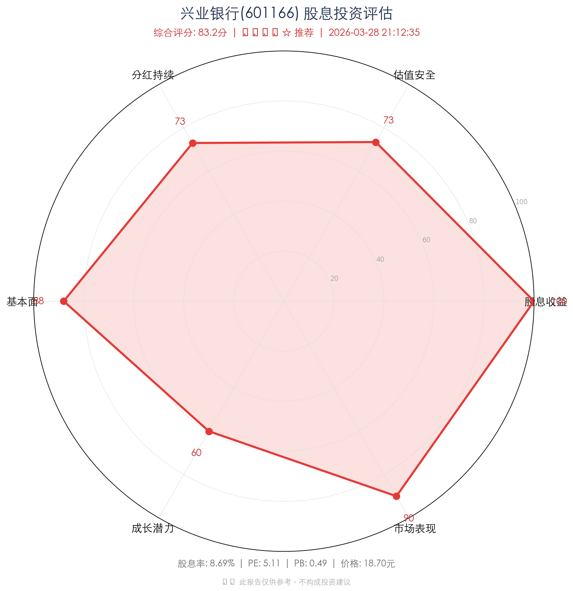
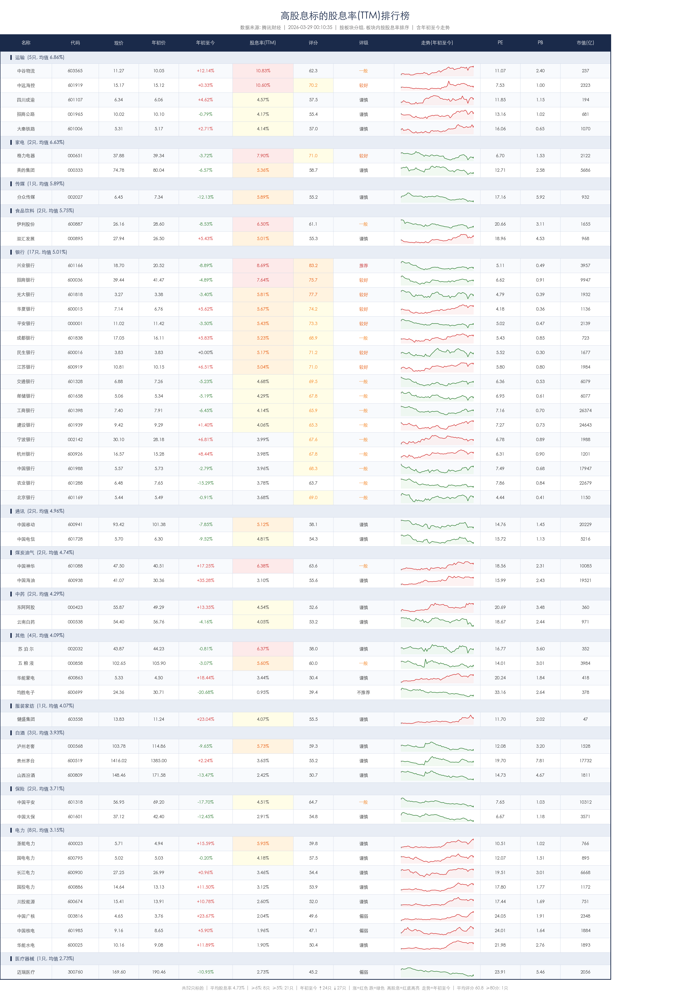

# 📊 股息投资综合评估系统 (Stock Dividend Evaluator)

> 一个基于 Python 的 A 股高股息标的投资分析工具，覆盖电力、银行、保险、白酒、通讯、运输等 **14 个板块 52 只标的**，支持 **多维度量化评分**、**综合星级评级**、**雷达图可视化** 和 **批量排名**。





---

## 🎯 功能特性

### 1. 高股息标的股息率排行榜 (`stock_dividend.py`)
- 从腾讯财经实时行情接口获取 **52 只 A 股高股息标的**（覆盖电力、银行、保险、白酒、通讯、运输等 14 个板块）的股息率、PE、PB、市值等核心指标
- 一次查询获取年初至今全部日 K 线数据（年初价格 + 走势数据合并查询，减少 API 请求）
- 绘制年初至今迷你走势图 (sparkline)，涨红跌绿
- 按板块分组排序（板块按平均股息率降序，板块内按个股股息率降序）
- 六维综合评分（股息收益、估值安全、分红持续性、基本面、成长潜力、市场表现）
- 输出排行榜（终端表格 + CSV + 精美图片）

### 2. 六维综合评估引擎 (`dividend_evaluator.py`)
对标的进行 **六大维度** 量化评分，总分 100 分：

| 维度 | 权重 | 说明 |
|------|------|------|
| 💰 股息收益 | 25% | 股息率 (TTM)，与无风险利率/定存对比，同业排名 |
| 🛡️ 估值安全边际 | 20% | PE、PB、52 周价格位置、同业对比 |
| 📈 分红持续性 | 15% | 历史分红年数、稳定性 (变异系数)、增长趋势、分红率 |
| 🏦 基本面稳健度 | 20% | 隐含 ROE、市值规模、估算分红率、格雷厄姆指标 (PE×PB) |
| 🚀 成长潜力 | 10% | 年初至今涨跌、PB 修复空间、距52周高点距离 |
| 📊 市场表现 | 10% | 流通市值、52周波动率、换手率 |

### 3. 星级评级系统
根据六维加权总分自动映射星级评级：

| 分数 | 评级 | 含义 |
|------|------|------|
| ≥ 90 | ⭐⭐⭐⭐⭐ 强烈推荐 | 极佳的高股息投资标的 |
| ≥ 80 | ⭐⭐⭐⭐☆ 推荐 | 优质的股息投资选择 |
| ≥ 70 | ⭐⭐⭐⭐ 较好 | 适合稳健型股息投资 |
| ≥ 60 | ⭐⭐⭐☆ 一般 | 股息投资价值中等 |
| ≥ 50 | ⭐⭐⭐ 谨慎 | 股息投资吸引力有限 |
| ≥ 40 | ⭐⭐☆ 偏弱 | 不太适合股息投资策略 |
| < 40 | ⭐⭐ 不推荐 | 股息投资价值较低 |

### 4. 评估报告输出 (`evaluate_stock.py`)
- 📋 结构化文字报告（六维评分明细 + 关键指标 + 优劣势分析 + 投资建议）
- 🖼️ 雷达图可视化（支持中文字体自动检测）
- 📊 批量评估所有标的并排名，导出 CSV

---

## 📦 数据来源

所有数据均来自公开免费接口，无需 API Key：

| 数据 | 接口 | 说明 |
|------|------|------|
| 实时行情 | `qt.gtimg.cn` | 腾讯财经实时行情（股息率、PE、PB、52周高低等） |
| 年初至今K线 | `web.ifzq.gtimg.cn` | 腾讯 K 线接口（前复权日K，年初价格 + 走势数据一次查询） |
| 分红历史 | `datacenter-web.eastmoney.com` | 东方财富分红送转数据 (RPT_SHAREBONUS_DET) |

---

## 🚀 快速开始

### 环境要求

- Python 3.7+
- 网络连接（需访问腾讯财经和东方财富接口）

### 安装依赖

```bash
pip install -r requirements.txt
```

依赖包：
- `requests` — HTTP 请求
- `matplotlib` — 雷达图 & 排行榜图片生成
- `numpy` — 数值计算

### 评估单只股票

```bash
# 评估兴业银行（代码 sh601166）
python evaluate_stock.py sh601166

# 评估并生成雷达图
python evaluate_stock.py sh601166 --image

# 指定图片输出路径
python evaluate_stock.py sh601166 --image --output /path/to/output.png
```

**输出示例：**
```
╔════════════════════════════════════════════════════════════════════════╗
║                        股息投资综合评估报告                            ║
║                     兴业银行(601166)                                  ║
╚════════════════════════════════════════════════════════════════════════╝

🏆 综合评分: 83.2 / 100    评级: ⭐⭐⭐⭐☆ 推荐
   优质的股息投资选择

📊 六维评分明细:
──────────────────────────────────────────────────────────────────────────
  💰 股息收益     █████████████████████░░░░ 85.0/100 (权重25%, 加权21.3)
  🛡️ 估值安全边际  ████████████████████░░░░░ 81.5/100 (权重20%, 加权16.3)
  ...
```

### 交互模式

```bash
python evaluate_stock.py
```

支持多种输入格式：
- 腾讯代码：`sh601166`
- 6 位代码：`601166`
- 股票名称：`兴业银行`
- 输入 `batch` 批量评估所有标的
- 输入 `quit` 退出

### 批量评估所有标的

```bash
python evaluate_stock.py --batch
```

对 52 只高股息标的进行综合评分并排名，结果保存为 `evaluation_ranking.csv`。

**输出示例：**
```
📊 股息投资综合评估排行榜
══════════════════════════════════════════════════════════════════════════
排名 │ 标的       │ 代码     │ 综合评分 │ 评级                │ 股息率 │ PE    │ PB
──────────────────────────────────────────────────────────────────────────
   1 │ 工商银行   │ sh601398 │  86.5分 │ ⭐⭐⭐⭐☆ 推荐       │ 5.80% │  5.12 │  0.65
   2 │ 兴业银行   │ sh601166 │  83.2分 │ ⭐⭐⭐⭐☆ 推荐       │ 5.62% │  5.34 │  0.52
   ...
```

### 查看高股息标的排行榜

```bash
python stock_dividend.py
```

输出：
- 终端排行表格（含年初至今涨跌幅、股息率、PE/PB 等）
- `stock_dividend.csv` — 排行数据
- `stock_dividend.png` — 精美排行榜图片（含年初至今走势图）

---

## 📁 项目结构

```
stock_divide/
├── stock_dividend.py         # 高股息标的排行工具（数据获取 & 图表生成）
│                              # - STOCK_LIST: 52只高股息标的代码列表(14板块)
│                              # - fetch_tencent_quotes(): 腾讯行情API
│                              # - parse_quotes(): 行情数据解析
│                              # - fetch_year_klines(): 年初至今K线(年初价格+走势)
│                              # - generate_table_image(): 排行榜图片生成
│                              # - _find_cjk_font(): 中文字体检测
├── dividend_evaluator.py     # 六维综合评估引擎（核心评分逻辑）
│                              # - DividendEvaluator: 评估器类
│                              # - 六个维度评分函数
│                              # - 评级映射 & 结论生成
├── evaluate_stock.py         # 评估报告输出 & CLI 入口
│                              # - print_report(): 格式化文字报告
│                              # - generate_radar_chart(): 雷达图生成
│                              # - batch_evaluate(): 批量评估排名
│                              # - resolve_code(): 股票代码解析
├── requirements.txt          # Python 依赖 (requests, matplotlib, numpy)
├── stock_dividend.csv        # 高股息标的排行数据 (运行后生成)
├── stock_dividend.png        # 高股息标的排行图片 (运行后生成)
├── eval_*.png                # 个股评估雷达图 (运行 evaluate_stock.py --image 后生成)
└── README.md                 # 项目说明文档
```

---

## 📐 核心算法详解

### 1. 股息收益评分 (25%)

```
基准分: 根据股息率绝对值分级
  ├── 8%+  → 95~100分    ├── 7%+  → 85~95分
  ├── 6%+  → 75~85分     ├── 5%+  → 65~75分
  ├── 4%+  → 55~65分     ├── 3%+  → 40~55分
  └── <3%  → 10~40分

加分项:
  • 同业排名加分: 前5%加5分 | 前10%加3分 | 前20%加1分
  • 无风险利率对比: ≥5倍加3分 | ≥4倍加2分 | ≥3倍加1分
```

### 2. 估值安全边际评分 (20%)

| 子项 | 满分 | 评分规则 |
|------|------|----------|
| PE 评分 | 30 | PE ≤ 4 满分，逐级递减至 PE > 10 |
| PB 评分 | 35 | PB ≤ 0.3 满分，深度破净高分 |
| 52 周位置 | 20 | 越靠近 52 周低点分越高 |
| 同业对比 | 15 | 与同类标的估值比较 |

### 3. 分红持续性评分 (15%)

| 子项 | 满分 | 评分规则 |
|------|------|----------|
| 连续分红年数 | 30 | ≥15 年满分，逐级递减 |
| 分红稳定性 | 25 | 变异系数 (CV) 越低越好：CV ≤ 0.1 满分 |
| 分红增长趋势 | 25 | 近期分红 > 远期分红得高分 |
| 分红率合理性 | 20 | 30%-50% 为最优区间 |

### 4. 基本面稳健度评分 (20%)

| 子项 | 满分 | 评分规则 |
|------|------|----------|
| 隐含 ROE | 30 | PB/PE×100 作为 ROE 代理，≥12% 满分 |
| 总市值 | 20 | 大市值 (≥10000亿) 满分，逐级递减 |
| 估算分红率 | 25 | 股息率×PE 估算，25%-50% 为优 |
| 格雷厄姆指标 | 25 | PE×PB < 3 极佳，< 4.5 较好 |

### 5. 成长潜力评分 (10%)

- **年初至今表现** (28分)：涨幅越大分越高
- **PB 修复空间** (40分)：破净越深，理论修复空间越大
- **距 52 周高点** (28分)：距高点越远，潜在反弹空间越大

### 6. 市场表现评分 (10%)

- **流通市值** (35分)：大市值流动性充足
- **52 周波幅** (35分)：波动率越低越好（稳健型偏好）
- **换手率** (30分)：0.2%-1.5% 为最佳交易活跃度区间

---

## 🔧 关键参数配置

在 `dividend_evaluator.py` 中可调整以下基准参数：

```python
# 各维度权重
SCORE_WEIGHTS = {
    "dividend_yield": 0.25,       # 股息收益权重
    "valuation_safety": 0.20,     # 估值安全边际权重
    "dividend_continuity": 0.15,  # 分红持续性权重
    "fundamentals": 0.20,         # 基本面稳健度权重
    "growth_potential": 0.10,     # 成长潜力权重
    "market_performance": 0.10,   # 市场表现权重
}

# 基准利率
BENCHMARKS = {
    "risk_free_rate": 1.5,        # 无风险利率 (%)
    "deposit_rate_3y": 1.50,      # 3年期定存利率 (%)
}
```

---

## 📈 覆盖板块与标的

共计覆盖 **52 只** A 股高股息标的，涵盖 **14 个板块**：

| 板块 | 标的 |
|------|------|
| ⚡ 电力 (9) | 中国广核、中国核电、长江电力、华能水电、国投电力、川投能源、内蒙华电、浙能电力、国电电力 |
| 🏦 银行 (17) | 农业银行、工商银行、宁波银行、招商银行、中国银行、建设银行、交通银行、邮储银行、成都银行、江苏银行、北京银行、平安银行、杭州银行、兴业银行、光大银行、华夏银行、民生银行 |
| 🛡️ 保险 (2) | 中国平安、中国太保 |
| 🍷 白酒 (4) | 贵州茅台、五粮液、泸州老窖、山西汾酒 |
| 📡 通讯 (2) | 中国移动、中国电信 |
| 🚛 运输 (5) | 中远海控、大秦铁路、中谷物流、四川成渝、招商公路 |
| 🏥 医疗器械 (1) | 迈瑞医疗 |
| 📺 传媒 (1) | 分众传媒 |
| 🍜 食品饮料 (2) | 伊利股份、双汇发展 |
| 🔌 家电 (3) | 美的集团、格力电器、海尔智家 |
| ⛏️ 煤炭油气 (2) | 中国神华、中国海油 |
| 🍳 小家电 (1) | 苏泊尔 |
| 💊 中药 (2) | 云南白药、东阿阿胶 |
| 👔 服装家纺 (1) | 健盛集团 |

---

## 📋 命令行参数一览

```
usage: evaluate_stock.py [-h] [--image] [--batch] [--output OUTPUT] [stock_code]

股息投资综合评估系统

positional arguments:
  stock_code            股票代码，如 sh601166 或 601166 或 兴业银行

optional arguments:
  -h, --help            显示帮助信息
  --image               生成雷达图
  --batch               批量评估所有标的
  --output, -o OUTPUT   图片输出路径
```

---

## ⚠️ 免责声明

> **本工具仅供学习和参考用途，不构成任何投资建议。**
>
> - 评估结果基于历史数据和当前市场指标，过往表现不代表未来收益
> - 评分模型和权重设置包含主观判断，不同投资者的偏好可能不同
> - 数据来源为第三方公开接口，不保证数据的准确性和实时性
> - 股市有风险，投资需谨慎，请在做出投资决策前咨询专业人士

---

## 📄 License

MIT License
